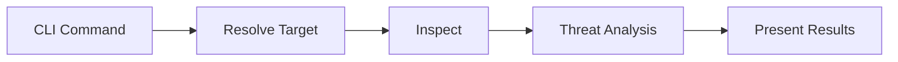
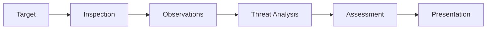
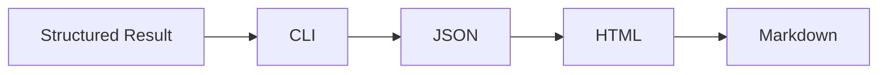

# SentinelX Architecture

## Overview

SentinelX is a CLI-first security inspection tool that analyzes untrusted digital content before it is opened, executed, or trusted.

The architecture is designed around a single inspection pipeline that supports multiple target types while keeping analysis, assessment, and presentation separated.

---

## Design Principles

- Never execute untrusted content.
- Collect evidence before making assessments.
- Explain every assessment with supporting evidence.
- Keep responsibilities isolated.
- Keep dependencies one-directional.
- Design for extensibility without changing the inspection pipeline.

---

## High-Level Architecture



---

## Components

### CLI

Responsibilities

- Parse command-line arguments.
- Resolve user options.
- Invoke the Core.
- Display results.
- Return exit codes.

Does not

- Inspect targets.
- Perform analysis.
- Apply detection rules.
- Calculate assessments.

---

### Core

Responsibilities

- Resolve inspection targets.
- Select inspection capabilities.
- Execute inspections.
- Collect observations.
- Perform threat analysis.
- Generate assessments.
- Produce structured results.

Does not

- Parse CLI arguments.
- Print terminal output.
- Manage user interaction.

---

### Presentation

Responsibilities

- Render CLI output.
- Export JSON.
- Export HTML.
- Export Markdown.

Does not

- Inspect targets.
- Perform analysis.
- Generate assessments.

---

## Inspection Flow



Each stage has a single responsibility.

---

## Inspection Targets

The inspection pipeline is independent of target type.

Supported targets include:

- Files
- Archives
- Executables
- Documents
- URLs
- Projects
- Shell Commands
- PowerShell Commands

Additional targets may be introduced without changing the overall architecture.

---

## Threat Analysis

Threat analysis evaluates collected observations to identify suspicious behaviors, techniques, or attack patterns.

Examples include:

- Credential harvesting
- Cookie theft
- Session hijacking
- Phishing
- Remote code execution
- Persistence
- Obfuscation
- Downloader behavior
- Supply-chain attacks

Threat analysis should always be supported by observable evidence.

---

## Assessment

Assessments summarize the overall security posture of the inspected target.

Assessments should explain:

- What was detected.
- Why it is suspicious.
- What data or resources are affected.
- What the potential impact is.

Assessments must never exist without supporting observations.

---

## Presentation Flow



Presentation formats never perform inspection or threat analysis.

---

## Dependency Rules

```text
CLI
    │
    ▼
Core
    │
    ▼
Presentation
```

Rules

- Dependencies flow in one direction.
- Lower layers never depend on upper layers.
- CLI never performs inspection.
- Presentation never performs analysis.
- Core remains independent from presentation.

---

## Project Structure

```text
sentinelx/

├── cli/
├── core/
├── docs/
├── tests/
├── Cargo.toml
├── README.md
└── LICENSE
```

Internal organization of `core` may evolve as complexity increases without changing the architecture described in this document.