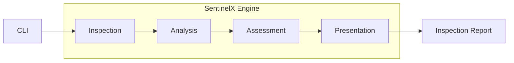
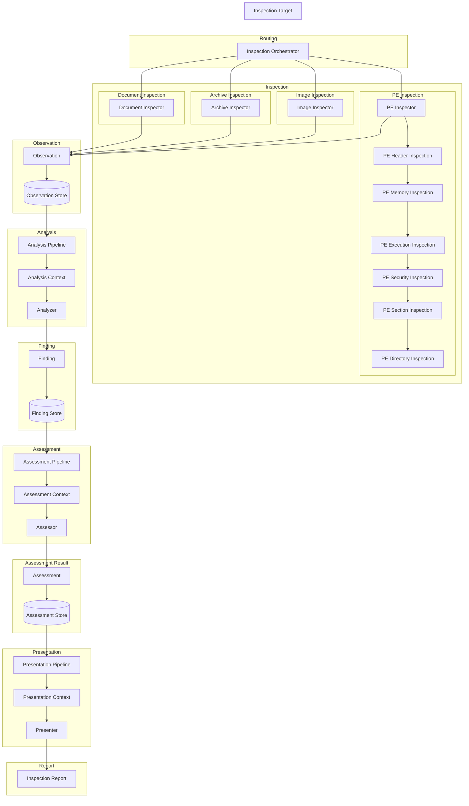

# Figure 1.1 — System Overview

### Shows the external interaction between the user, SentinelX, and the inspection result.

# Figure 1.2 — High-Level Architecture

# Figure 1.3 — Low-Level Architecture (Master)

