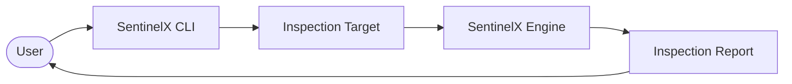
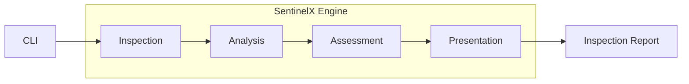
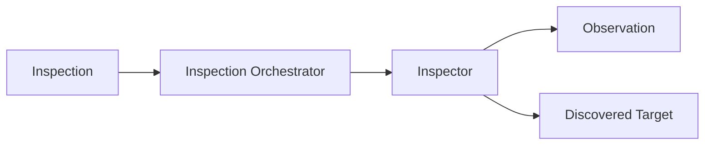
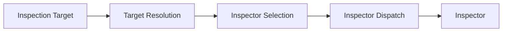
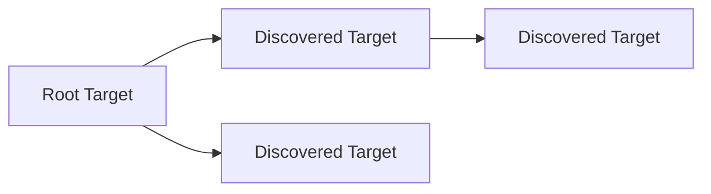
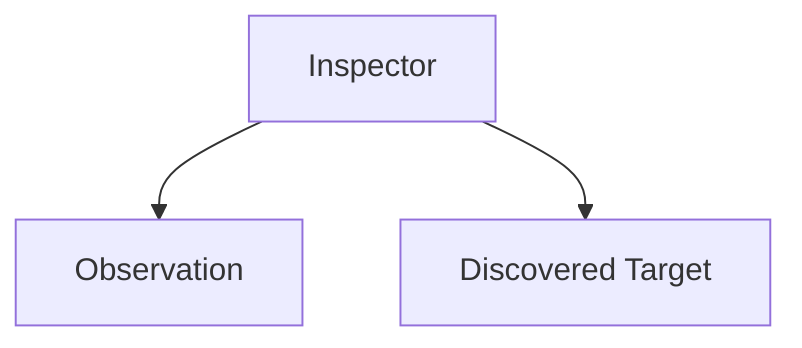
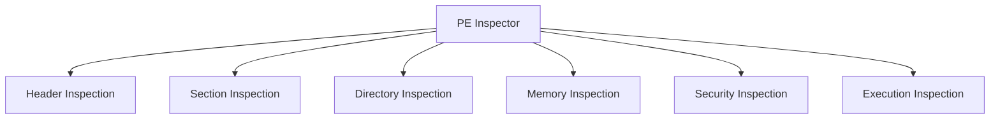

# Diagram

## Figure 1.1 — System Overview

## Figure 1.2 — High-Level Architecture

## Figure 1.3 — Low-Level Architecture (Master)

```mermaid
flowchart TB

%% ===================================================================
%% INPUT
%% ===================================================================

InspectionTarget["Inspection Target"]

%% ===================================================================
%% ROUTING
%% ===================================================================

subgraph SG_Routing["Routing"]

InspectionOrchestrator["Inspection Orchestrator"]

end

InspectionTarget --> InspectionOrchestrator


%% ===================================================================
%% INSPECTION
%% ===================================================================

subgraph SG_Inspection["Inspection"]

    subgraph SG_PEInspection["PE Inspection"]

        PEInspector["PE Inspector"]

        PEHeaderInspection["PE Header Inspection"]

        PEMemoryInspection["PE Memory Inspection"]

        PEExecutionInspection["PE Execution Inspection"]

        PESecurityInspection["PE Security Inspection"]

        PESectionInspection["PE Section Inspection"]

        PEDirectoryInspection["PE Directory Inspection"]

        PEInspector --> PEHeaderInspection

        PEHeaderInspection --> PEMemoryInspection

        PEMemoryInspection --> PEExecutionInspection

        PEExecutionInspection --> PESecurityInspection

        PESecurityInspection --> PESectionInspection

        PESectionInspection --> PEDirectoryInspection

    end

    subgraph SG_DocumentInspection["Document Inspection"]

        DocumentInspector["Document Inspector"]

    end

    subgraph SG_ArchiveInspection["Archive Inspection"]

        ArchiveInspector["Archive Inspector"]

    end

    subgraph SG_ImageInspection["Image Inspection"]

        ImageInspector["Image Inspector"]

    end

end

InspectionOrchestrator --> PEInspector
InspectionOrchestrator --> DocumentInspector
InspectionOrchestrator --> ArchiveInspector
InspectionOrchestrator --> ImageInspector


%% ===================================================================
%% OBSERVATION
%% ===================================================================

subgraph SG_Observation["Observation"]

    Observation["Observation"]

    ObservationStore[("Observation Store")]

    Observation --> ObservationStore

end


DocumentInspector --> Observation
ArchiveInspector --> Observation
ImageInspector --> Observation
PEDirectoryInspection --> Observation

%% ===================================================================
%% ANALYSIS
%% ===================================================================

subgraph SG_Analysis["Analysis"]

    AnalysisPipeline["Analysis Pipeline"]

    AnalysisContext["Analysis Context"]

    Analyzer["Analyzer"]

end

ObservationStore --> AnalysisPipeline

AnalysisPipeline --> AnalysisContext

AnalysisContext --> Analyzer

%% ===================================================================
%% FINDING
%% ===================================================================

subgraph SG_Finding["Finding"]

    Finding["Finding"]

    FindingStore[("Finding Store")]

    Finding --> FindingStore

end

Analyzer --> Finding

%% ===================================================================
%% ASSESSMENT
%% ===================================================================

subgraph SG_Assessment["Assessment"]

    AssessmentPipeline["Assessment Pipeline"]

    AssessmentContext["Assessment Context"]

    Assessor["Assessor"]

    AssessmentPipeline --> AssessmentContext

    AssessmentContext --> Assessor

end

FindingStore --> AssessmentPipeline

%% ===================================================================
%% ASSESSMENT RESULT
%% ===================================================================

subgraph SG_AssessmentResult["Assessment Result"]

    Assessment["Assessment"]

    AssessmentStore[("Assessment Store")]

    Assessment --> AssessmentStore

end

Assessor --> Assessment

%% ===================================================================
%% PRESENTATION
%% ===================================================================

subgraph SG_Presentation["Presentation"]

    PresentationPipeline["Presentation Pipeline"]

    PresentationContext["Presentation Context"]

    Presenter["Presenter"]

    PresentationPipeline --> PresentationContext

    PresentationContext --> Presenter

end

AssessmentStore --> PresentationPipeline

%% ===================================================================
%% REPORT
%% ===================================================================

subgraph SG_Report["Report"]

    InspectionReport["Inspection Report"]

end

Presenter --> InspectionReport
```

## Figure 2.1 — Inspection Architecture

## Figure 2.2 — Inspection Routing

## Figure 2.3 — Inspection Target

## Figure 2.4 — Inspector Contract

## Figure 2.5 — PE Inspection

